# OSHA_300A_Reporting_Evaluation
OSHA 300A submission review 2016 - 2020.  Injury and Illness reporting.

Review of information associated with illness and injury reporting required by OSHA  - OSHA Form 300A (Summary of Work-Related Injuries and Illnesses) from 2016 -2020.  

NOTE: The raw data files from OSHA were reviewed as part of this effort.  A very small percentage of the more than 1.3 million rows of data in the combined dataset were amended as part of the exercise.  This was not done to misrepresent the data, but to correct very obvious errors in either employee numbers of hours worked.  A summary of the amendments is presented in the charts showing raw and amended hours.  The corrections were not to identify issues with the data provider but to allow for more representative data.  As a person that has worked with this type of data it is understandable that errors can be made.  The rows of obvious incorrect data could have been deleted, but when a correction was easily identified, it was made. If the error was less than 2X the theoretical value, no changes were made. The point of this exercise is to show trends on a State and NAICS basis and not flag individual sites. An amended and raw data presentation could not be presented together in the public version of Tableau because of the size of the files.  

<u>OSHA 300A overview</u>

On an annual basis, designated employers are required to submit their OSHA 300A https://www.osha.gov/recordkeeping. The 300A is a record of each OSHA recordable injury or illness which occurred at the employer's location during the reporting period.

 

OSHA defines a recordable injury or illness as:
 
 - Any work-related fatality
 
 - Any work-related injury or illness that results in loss of consciousness, days away from work, restricted work, or transfer to another job
  
 - Any work-related injury or illness requiring medical treatment beyond first aid
  
 - Any work-related diagnosed case of cancer, chronic irreversible diseases, fractured or cracked bones or teeth, and punctured eardrums
  
 - There are also special recording criteria for work-related cases involving: needlesticks and sharps injuries; medical removal; hearing loss; and tuberculosis.

 

For sake of brevity on background information and getting to the info, First Aid is defined below.

 

<u>Data Review</u>

Link to Tableau charts and tables: https://public.tableau.com/views/OSHA_Injury_Data_Evaluation/Story1?:language=en-US&publish=yes&:display_count=n&:origin=viz_share_link

 

Overall Statistics 2016 - 2020

California has the most number of employers reporting during the period at 132,492.  Based on 2017-2020 data, California appears to have an underreporting value of approximately 23,000 in 2016. Taking that into account, California should actually be in the range of 162,000 employers reporting in the evaluation timeframe.  Wyoming has the least value at 2,127.

 

The OSHA incident rate formula is (# of injury and illness X 200,000) / Employee hours worked.  This formula is used to normalize the incident rate.  The 200,000 value represents the number of hours worked in a year by 100 employees working 40 hours per week for 50 weeks (assumes 2 weeks of vacation). On a state wide basis, Maine has the highest incident rate at 6.03 for every 100 employees.  Louisiana has the lowest at 1.59.

 

Businesses were either grouped in a 2 digit or 3 digit NAICS cateogry for ease of reporting and visualization. 62 - Healthcare and Social Assistance had the greatest number of employers reporting at 154,972.  482 - Rail Transportation has the least at 18.  491 - Postal Workers had the highest incident rate at 7.00 for every 100 employees.  523 - Securities, Commodity Contracts, and other Financial Investments and Related Activities has the lowest incident rate at 0.21.

 

Another reporting statistic is Days Away, Restricted, or Transferred (DART).  The formula for DART rate is (# of DART incidents X 200,000) / Employee hours worked.  On a state wide basis, Maine has the highest DART rate at 2.41 for every 100 employees.  New York has the lowest at 0.28.

 

There is more data to search and review on a state, NAICS, and reporting year basis. Link to Tableau charts and tables: https://public.tableau.com/app/profile/troy.youngblood/viz/OSHA_Injury_Data_Evaluation/Story1?publish=yes

Examples of charts/tables to review

 

An interactive US map that allows for selecting State, NAICS code, and Year to see how the various reporting values change.  Hover on the state and state respetive data will be shown.

 
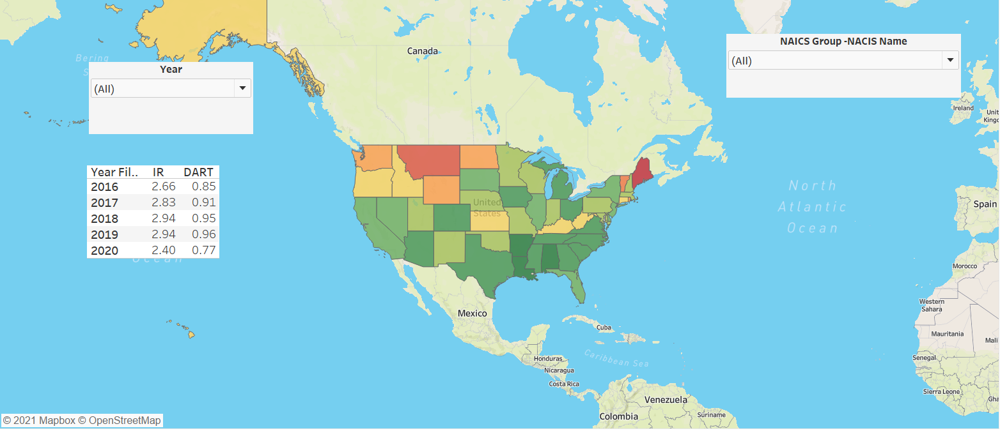 
 

This two charts below show incident rate (IR) and days away from work (DAFW) severity. The first is by reporting State and the second id by NAICS code. Incident rate is defined above.  DAFW severity is the total days away from work for designated cases divided by the number of DAFW cases.  DAFW cases are a subset of total cases used in incident rate. The DAFW severity rate provides an average number of days away from work for each case. The higher the DAFW rate (days/incident) the longer a person on average was absent from work after an incident inferring a more sever incident. When developing safety and health corrective action plans, the line graphs present valuable information that can be used to measure program effectiveness.  Program effectivness is a question that is asked under ISO 45001 and other Quality programs and this type of information can be used to support that program.   At the bottom of the chart are bars charts that represent the delta between incident rate and DAFW severity rate.  Under optimum conditions, the delta is trending downward as both IR and DAFW trend downward.  The larger gap and times when IR is going down, but DAFW is going up, this infers the severity of the cases is increasing. This data provides valuable information on where to focus limited resources and time. 
   
 
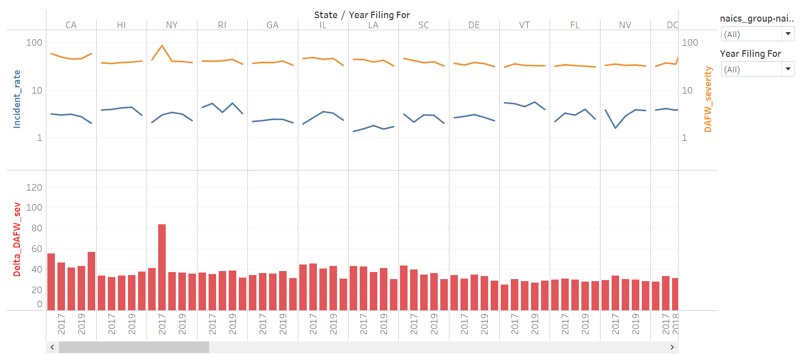 
 
 
 
 
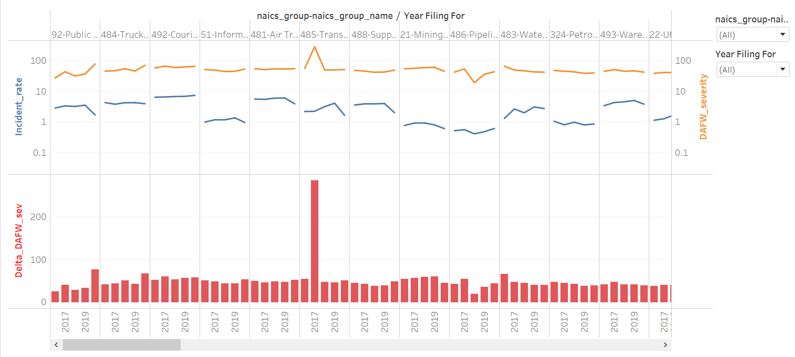 
 

These two charts below are similar to the two above, except the data is showing DART rate and Days Job Transferred or Restricted (DJTR) severity.  The importance of the data is similar to the charts above, but presents only cases and days associated with an individual being at work but temporarily transferred to another job or working at thier current position with restrictions until they are cleared to work without restrictions.
 
 
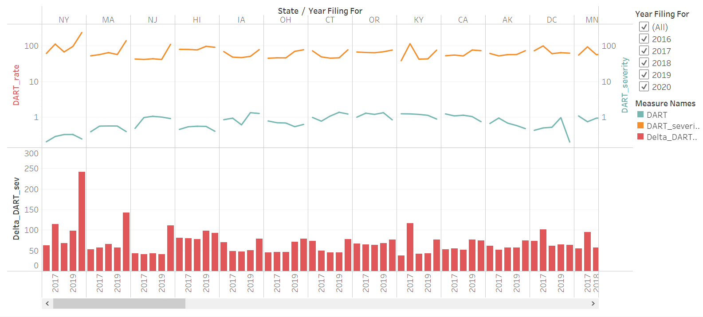 
 
 
 
 
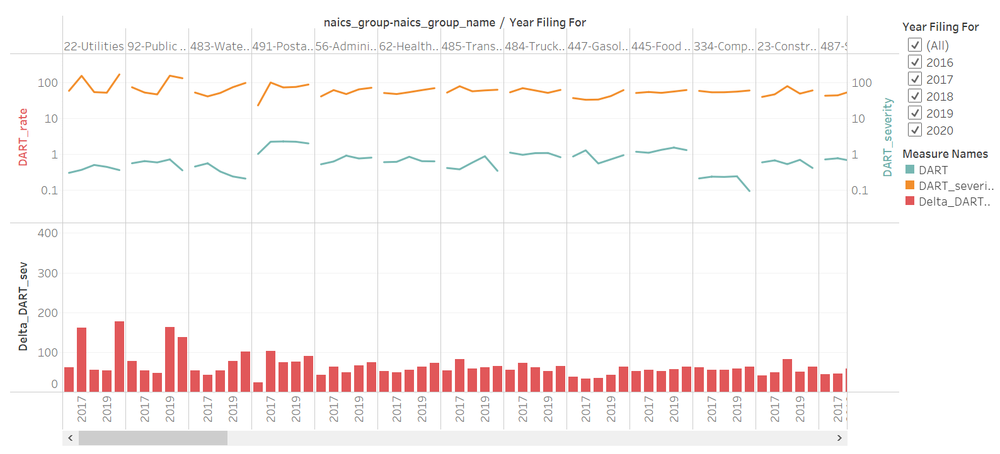 
 
 

The chart below consists of tables that allow a user to view basic data by State or NAICS.
 
 
 
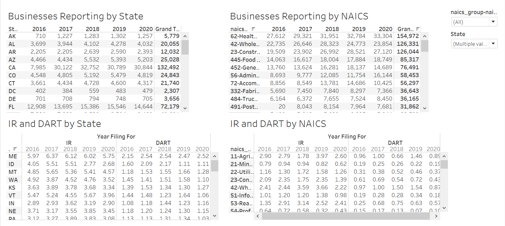 
 

The chart below consists of raw hours (hours presented in the original OSHA files) represented by the center red line against the hours used for visualization. The information is presented by State and NAICS.  When conducting a preliminary review of the data, it was very obvious there were issues with some of the data entered.  The process taken to address the larger issues is detailed more below, but in general - the raw hours worked for the year were plotted against the theoretical total hours.  The theoretical total hours were obtained by multiplying the number of employees by 2000.  Then, if the raw hours were 2X the theoretical, then the raw data was reviewed.  The most common issues were - employees and hours data entry switched, decimal points were attempted to be entered versus whole numbers, and grossly incorrect numbers entered.  To correct the obvious issues observed, employee and hour data was placed in correct column, the last 2 digits were removed when it was obvious decimal points were attempted to be entered and lastly when employee or hourly data was  obviously wrong the either the employee value was multiplied by 2000 or the hours were divided by 2000.  The purpose of this activty was not to determine statistical differences or to get into pure data science discussion which typically frowns on amending raw data.  The purpose was to show trends and use real life experience to review data for usability.  Trends and productive use of this type of data that is entered by humans is different than analytical data which would not be amended.  It also points out the need to ensure data entry requirements are understood and assistance is avaiable for those that have question.  Simple data sanity checks are avaialbe.
 
 
 
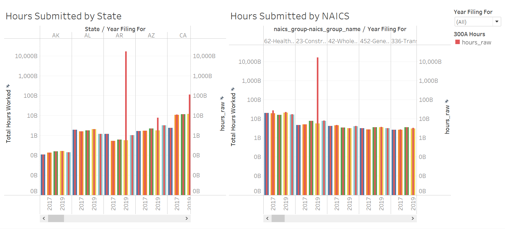 
 

The two charts under Backup shows respective IR data for State and NAICS sorting with number of businesses reporting plotted against calendar year.
 
 
 
 
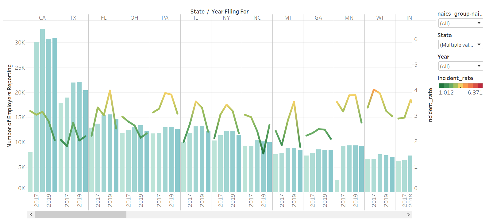 
 
 
 
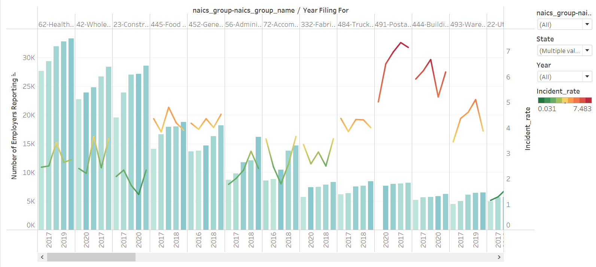 
 

<u>Data Extraction and Transformation</u>

Information was pulled from two locations.  North American Industry Classification System (NAICS) codes and descriptions where obtained from https://www.naics.com/search/.  The NAICS codes are used to group injury and illness information under related work descriptions.  Injury and illness data was pulled from: https://www.osha.gov/Establishment-Specific-Injury-and-Illness-Data.  Data was availalbe for 2016, 2017, 2018, 2019, and 2020.  All avaialbe years of data are used in this evaluation.

 

Using Python in Jupyter Notebook, the OSHA data was merged into a single file. After the combined OSHA data file was created, the "initial" NAICS file was merged on the naics_code column in the OSHA data file.  The resulting file was approximately 431MB and over 1.3 million rows of data.  The data was evalauted to determine if there were any issues that would create problems during visualization and also identify opportunities to improve data review.    The primary issues identified were state abbreviations were incorrectly entered, industry_description was not consistently entered (missing from ~100k rows), and many errors with hours and or employee count data.   State abbreviations and missing industry_description data was corrected during cleanup steps in Python and OSHA data entry was corrected in excel after the Python work was complete and is disucssed below.  Other minor cleanup in Python included dropping rows and filling some NaN with information from another column.

 

The data correction in excel required visualization of the raw data against theoretical hours (number of employees X 2000).  As noted above, the purpose of the data review was to find data that was obviously incorrect and make amendments using work experience.  It is understood that some may view this as something that should not be done, but the intent of this effort is to see trends at the higher levels.  If the purpose was to review line by line data entry and determine statistical differences, then a different approach could be taken. The data was observed in charts looking for instances when the theorectical hours were 2X the raw hours.  When this occurred, the raw data was first sorted by hours and reviewed by number of employees to see if the values were within 2X the expected values.  If hour data was out of expected ranges, then a couple different approaches were taken.  The first was to determine if it was obvious that too many digits were entered such as values after the decimal were accidentally added.  The second was to adjust the  hours by multiplying the number of employees by 2000.  The second sort was by employees and raw hours were reviewed to see if the vaues were within 2X the expected range.  If the employee values were out of range, an approach similar to above was taken.  Obvious errors were corrected such as flipping the hours and employee number columns.  This error hapended on many occasions.  When the error was not obvious, the hours were divided by 2000 to get theoretical number of employees.

 

The raw employee and hours data are maintained in the combined dataframe that was written as a csv for reference purposes.  Becuase the file has more 1.3 million lines, the file is difficult to open in excel.  Also, since the file is so large, it pushed the limits of the public version of Tableau and therefore all charts could not be included in the Tableau charts presented in the 300A data evaluation.  The raw data review was conducted in a different Tableau.  Below are snips of those charts.

 

The three charts below show the data sorted by state.  The red lines are the raw hours, the pink lines are theoretical hours, and the blue lines are theoretical hours.  All three charts provide examples of raw hours /theoretical hours differences.  The last chart is a single state charted by itself becuase the hours reported where in the trillions and therefore made the y-axis range so large, the other states almost all looked like straight lines.
 
 
 
 
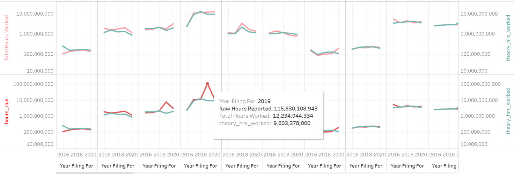 
 
 
 
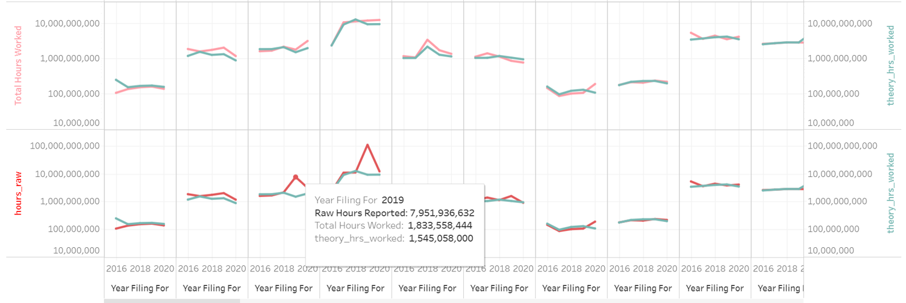 
 
 
 
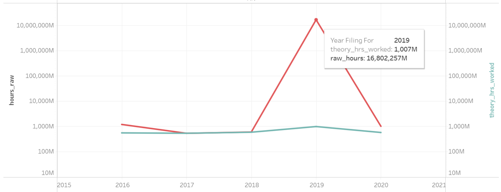 
 
 

The two charts below show the data sorted by NAICS.  The red lines are the raw hours, the pink lines are theoretical hours, and the blue lines are theoretical hours.  Both charts provide examples of raw hours /theoretical hours differences.
 
 
 
 
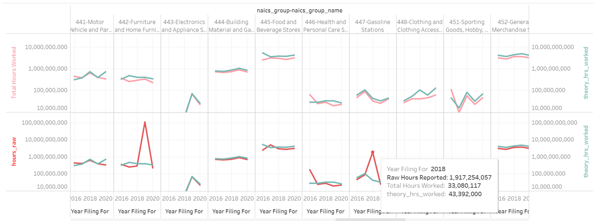 
 
 
 
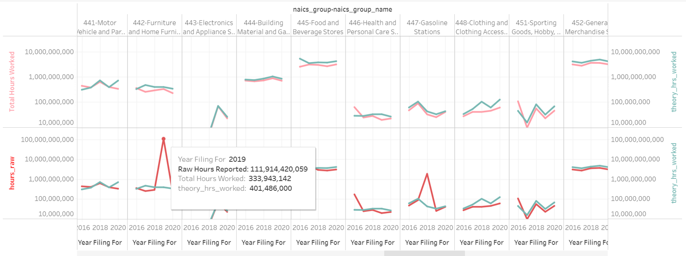 
 
 

OSHA defintion of First Aid

 

Using a non-prescription medication at nonprescription strength (for medications available in both prescription and non-prescription form, a recommendation by a physician or other licensed health care professional to use a non-prescription medication at prescription strength is considered medical treatment for recordkeeping purposes);
Administering tetanus immunizations (other immunizations, such as Hepatitis B vaccine or rabies vaccine, are considered medical treatment); Cleaning, flushing or soaking wounds on the surface of the skin
Using wound coverings such as bandages, Band-Aids™, gauze pads, etc.; or using butterfly bandages or Steri-Strips™ (other wound closing devices such as sutures, staples, etc., are considered medical treatment);
Using hot or cold therapy;
Using any non-rigid means of support, such as elastic bandages, wraps, non-rigid back belts, etc. (devices with rigid stays or other systems designed to immobilize parts of the body are considered medical treatment for recordkeeping purposes);
Using temporary immobilization devices while transporting an accident victim (e.g., splints, slings, neck collars, back boards, etc.). Drilling of a fingernail or toenail to relieve pressure, or draining fluid from a blister;
Using eye patches;
Removing foreign bodies from the eye using only irrigation or a cotton swab;
Removing splinters or foreign material from areas other than the eye by irrigation, tweezers, cotton swabs or other simple means;
Using finger guards;
Using massages (physical therapy or chiropractic treatment are considered medical treatment for recordkeeping purposes); or
Drinking fluids for relief of heat stress.

